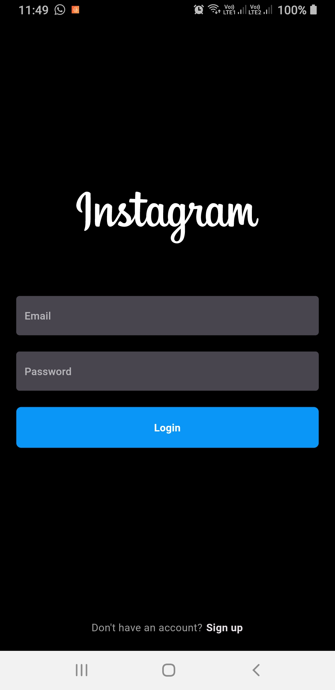
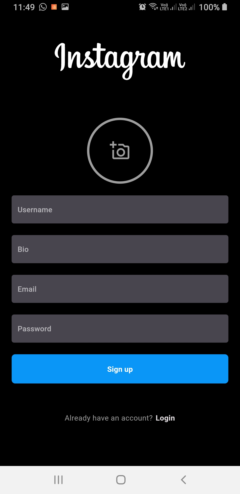
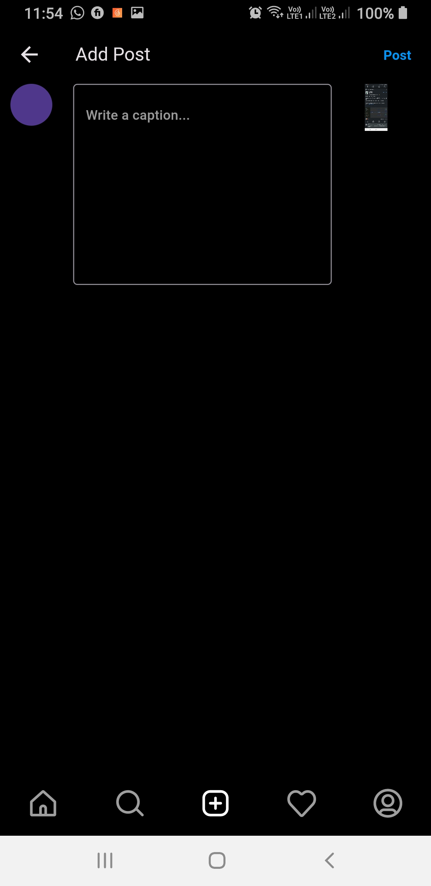
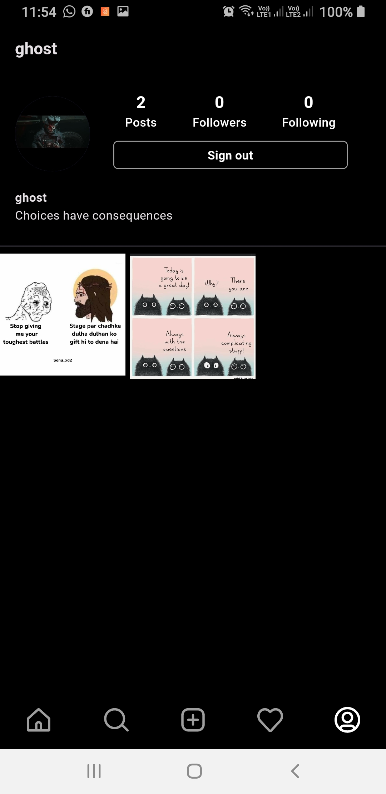

# Instagram Clone

The Instagram Flutter Clone is a visually stunning mobile app replica of the popular social media platform, Instagram. The app is built using Flutter and Firebase, which is a cloud-based platform for building mobile and web applications. The app is a part of my internship project at ByteWise Limited.

## Features

The following features are implemented in this project:

- Authentication
- Home Feed
- Profile
- Search
- Post
- Likes
- Comments
- Follow/Unfollow
- Logout

## Screenshots

<table>
  <tr>
    <td>Login</td>
     <td>Signup</td>
     <td>Home Feed</td>
  </tr>
  <tr>
    <td></td>
    <td></td>
    <td></td>
  </tr>  <tr>
    <td>Explore</td>
     <td>Upload Image</td>
     <td>Upload Post</td>
  </tr>
  <tr>
    <td></td>
    <td></td>
    <td></td>
  </tr><tr>
    <td>Profile</td>
  </tr>
  <tr>
    <td></td>
  </tr>
 </table>
